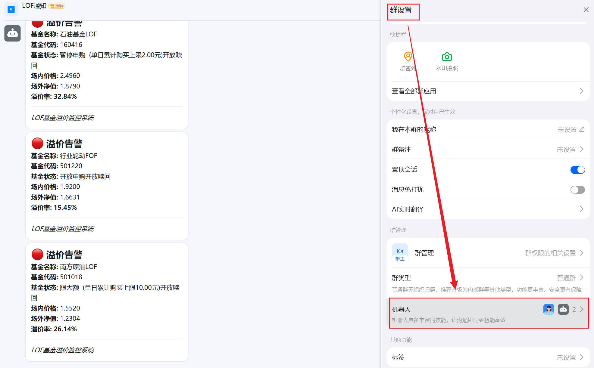
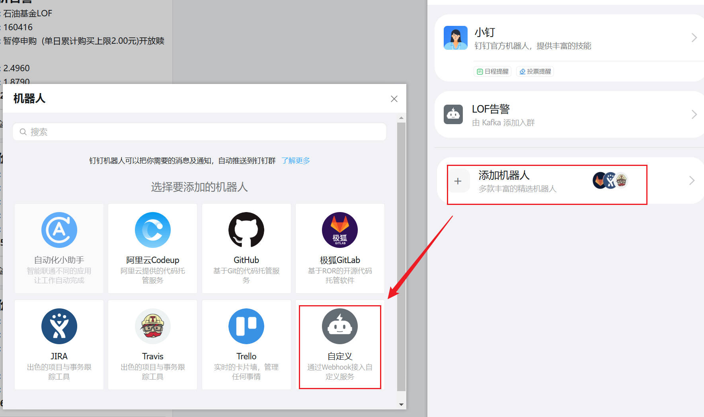
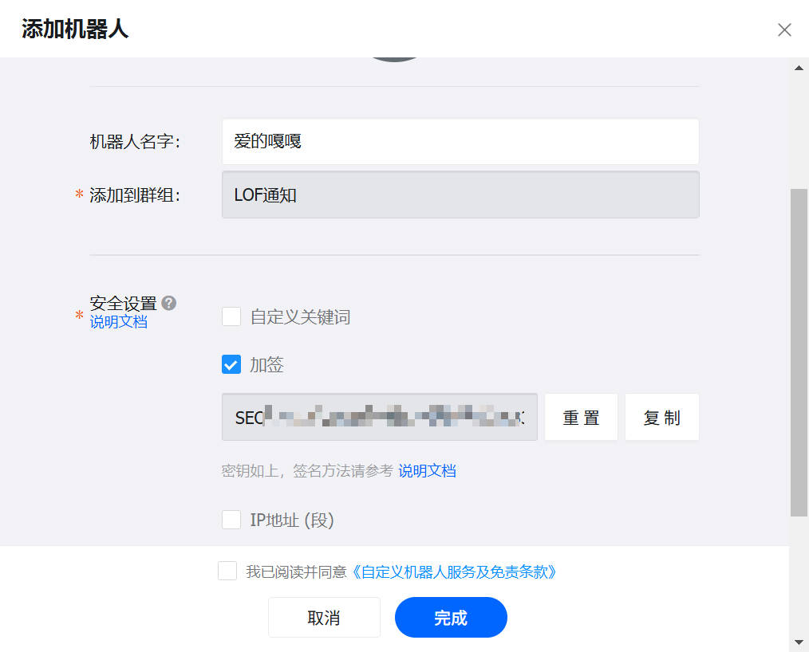
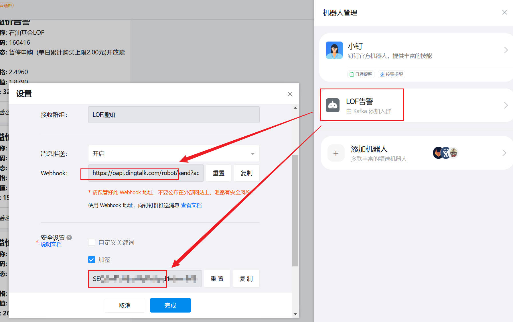

# LOF基金溢价监控系统

一个基于Python的LOF基金溢价/折价实时监控工具。支持 **图形界面 (UI)** 和 **终端模式 (CLI)** 双模运行，提供实时数据流式展示、智能去重告警及详细日志记录。


---

## ✨ 功能特性

### 1. 核心功能
- **📊 实时双重监控**：同步获取场内交易价格（Sina/AkShare）与场外单位净值（EastMoney）。
- **📈 高精度计算**：实时计算溢价率与折价率，支持自定义触发阈值。
- **🔔 智能告警系统**：支持钉钉机器人通知，内置 **每日去重逻辑**（同一基金一天仅发送一次告警），避免频繁骚扰。
- **🔍 深度数据集成**：不仅获取价格，还能解析基金当前的 **交易状态**（如：暂停申购、暂停赎回、场内停牌等）。

### 2. 多端体验
- **🎨 现代UI模式**：基于 `tkinter` 的深色主题界面，支持动态排序、搜索过滤、可视化进度显示。
- **💻 流式CLI模式**：专为开发者设计的终端模式，采用 **异步流式输出**，数据获取到哪行即刻打印哪行，无需等待全局加载。

---

## 🛠️ 实现逻辑

### 架构设计
程序采用模块化设计，确保逻辑与表现分离：
- **数据层 (`data_fetcher.py`)**：通过 `akshare` 获取基础列表，使用 `requests` + `BeautifulSoup` 实时爬取东方财富网解析基金状态。
- **计算层 (`calculator.py`)**：核心算法模块，统一溢价与折价的判定逻辑。
- **配置层 (`config.py`)**：基于 `json` 的持久化管理，记录用户偏好及 **当日告警指纹** 以实现去重。
- **通信层 (`notifier.py`)**：封装钉钉 `Markdown` 签名及发送逻辑。

### 关键技术点
- **流式回调机制**：数据获取器支持 `data_callback`。在终端模式下，每当提取完一只基金的完整数据（含状态解析），立即触发打印，实现了极佳的交互响应速度。
- **每日状态同步**：程序启动时会自动检测日期，跨天后自动清空 `alerted_funds` 列表，确保第二天的首个阈值突破能及时触达。

---

## 🚀 快速开始

### 1. 环境准备
确保已安装 Python 3.8 或更高版本：
```bash
python3 -m pip install -r requirements.txt
```

### 2. 运行程序
- **启动图形界面 (推荐)**:
  ```bash
  python3 main.py
  ```
- **启动终端模式**:
  ```bash
  python3 main.py -t
  ```

---

## 📖 使用说明

### 图形界面 (UI)
1. **监控设置**：在顶部直接修改“溢价阈值”和“折价阈值”，配置即刻生效并持久化。
2. **实时搜索**：搜索框支持模糊匹配基金代码或名称。
3. **钉钉配置**：点击“⚙️ 钉钉配置”填入 Webhook URL 和加签密钥。

### 🔔 如何获取钉钉 Webhook 和密钥

1. **创建机器人**：在钉钉群设置中，选择“智能群助手” -> “添加机器人” -> “自定义”。
   
2. **安全设置**：在机器人设置页面，勾选“加签”，复制生成的 **密钥**（SEC开头）。
   
3. **获取 Webhook**：完成设置后，复制生成的 **Webhook URL**。
   
4. **填入程序**：将获取的 Webhook 和密钥填入本程序的“钉钉配置”界面或 `config.json` 中。
   

### 终端模式 (CLI)
1. **交互菜单**：运行后可通过数字键选择“查看配置”、“修改配置”或“开始监控”。
2. **流式监控**：进入监控后，系统会循环刷新。匹配阈值的基金会立即出现在表格中。
3. **安静模式**：日志记录在后台自动运行，仅通过钉钉发送核心告警。

---

## ☁️ GitHub Actions 部署 (推荐)

如果你不想购买 VPS，可以使用 GitHub Actions 免费运行此监控脚本。系统会每 **30 分钟** 自动运行一次。

### 1. 配置权限
前往 GitHub 仓库：
- **Settings > Actions > General > Workflow permissions**
- 选择 **Read and write permissions** 并保存（用于自动更新告警状态）。

### 2. 配置 Secrets 和变量
前往 **Settings > Secrets and variables > Actions**：

- **Secrets (必填)**:
  - `DINGTALK_WEBHOOK`: 钉钉机器人 Webhook 地址。
  - `DINGTALK_SECRET`: 钉钉机器人加签密钥。
- **Variables (选填)**:
  - `PREMIUM_THRESHOLD`: 溢价阈值（如 `10.0`）。
  - `DISCOUNT_THRESHOLD`: 折价阈值（如 `30.0`）。

### 3. 开始运行
- 默认每 30 分钟自动运行。
- 你也可以在 **Actions** 标签页手动点击 **Run workflow** 立即运行。

---

## ⚠️ 免责声明

1. 本软件仅用于 **学习交流与技术研究**，不构成任何投资建议或参考。
2. 股市有风险，入市需谨慎。用户根据本软件提供的数据进行投资研究所造成的 **任何盈利或损失**，作者及开源贡献者均 **不承担任何法律责任**。
3. 本软件所引用的数据均来自第三方公开接口，其准确性、完整性及及时性需用户自行核实。

---

## 📄 许可协议

本项目使用 **GNU General Public License v3.0 (GPL-3.0)** 协议授权。

> [!IMPORTANT]
> **开源声明**：您可以自由地运行、学习、分享和修改本软件，但如果您分发本软件的修改版本，则必须同样在 GPL 协议下开源您的源代码。

---

## 📝 贡献与支持
如果您在使用中发现 Bug 或有功能建议，欢迎提交 Issue。
*Disclaimer: 本工具仅供投资研究参考，不构成任何投资建议。*
